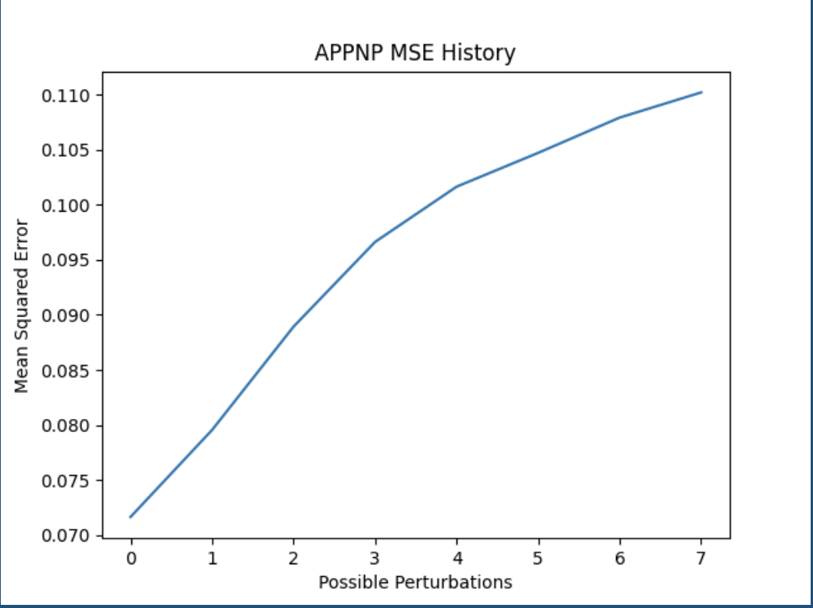
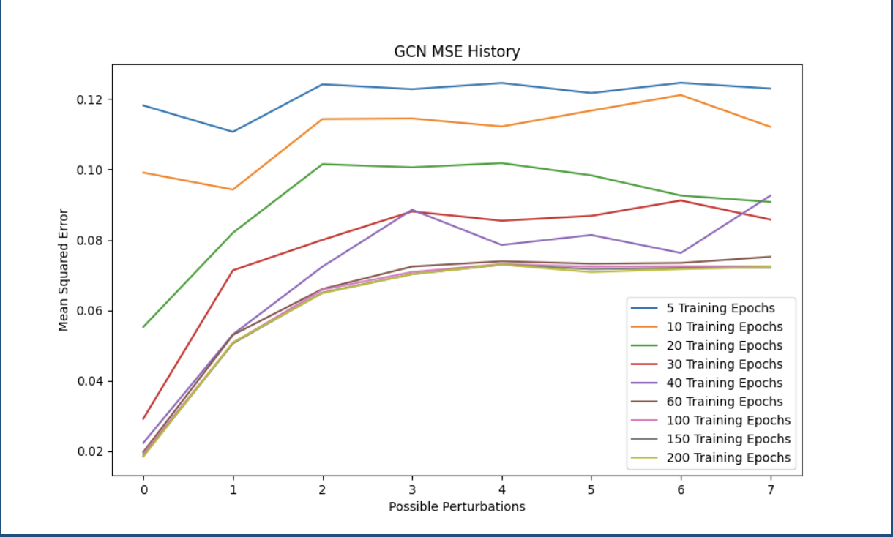

# Zhiyao (Mike) Zhang - Computer Science Portfolio

**Case Western Reserve University | CS Major**  
**Focus:** Applied Machine Learning, Data Pipeline Engineering, Computational Neuroscience  
[Email: zxz1233@case.edu](mailto:zxz1233@case.edu) | [LinkedIn](https://linkedin.com/in/michaelzhang112) | [View Technical Research Summary (PDF)](clinic-research/Research_Technical_Summary.pdf) 

## 🧠 Featured Project: Large-Scale Neural Data Analysis Pipeline
**Cleveland Clinic Lerner Research Institute** | Research Assistant | 2023–2025  
**Core Contribution:** Designed and implemented an end-to-end preprocessing pipeline for high-noise calcium imaging data (100,000+ frames).

- **Challenge:** Massive computational load and vascular artifacts obscuring neural signals.
- **My Solution:**
  1. Standardized masking protocol in ImageJ to isolate brain regions.
  2. Custom MATLAB scripts for intelligent downsampling and 3D-to-2D restructuring — **achieved 4x computational efficiency gain**.
  3. Normalization and integration for fpCNMF deep learning model.
- **Results:** Enabled extraction of distinct spatiotemporal neuronal motifs, revealing meaningful differences in autism-related patterns.

**Tech Stack:** MATLAB, ImageJ/Fiji, fpCNMF, Data Pipeline Architecture, Performance Optimization

(Full details in [Research Technical Summary PDF](clinic-research/Research_Technical_Summary.pdf)– includes flowchart and method summary)

## 📈 Academic & Research Projects

### Graph Neural Network Robustness Analysis
**Numerical Methods for Machine Learning Course Project** (Fall 2024)
- Implemented APPNP (Approximate Personalized Propagation of Neural Predictions) using Personalized PageRank.
- Analyzed propagation mechanisms, evaluation metrics, and robustness to simulated noise on graph data.
- Key Finding: APPNP showed improved performance under certain noise levels compared to GCN.

**Tech Stack:** Python, PyTorch Geometric, NetworkX, Jupyter

Example MSE Results (noise perturbations):

### Full-Stack Interactive Forum Web App
**Team Project** (Nov–Dec 2023)
- Led backend database design and implementation.
- Created ER model supporting 100+ thread/reply types (text/images) with full CRUD functionality.

**Tech Stack:** SQL, Database Design (ER Diagrams), Backend Logic

Database Structure (ER Diagram):

## 📁 Repository Navigation
- `./cleveland_clinic_analysis/` → Research proposal, award letter, and method summary.
- `./numerical_ml/` → GNN notebooks, presentation, and results.
- `./forum_web_app/` → Database design docs and contributions.

**Thank you for visiting!**  
I am actively seeking opportunities to apply my data engineering and machine learning skills to solve complex real-world problems, and I am preparing for transfer to a rigorous, industry-focused CS program in 2026. Feel free to reach out!

[Email Me](mailto:zxz1233@case.edu) | [LinkedIn](https://linkedin.com/in/michaelzhang112)
